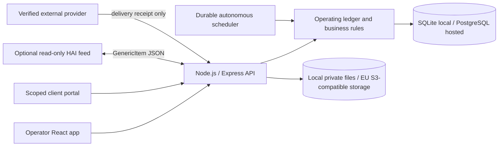

# Contractor.AI

[](https://github.com/Robert-Velhorst/002-Contractor-AI/actions/workflows/verify.yml)

Contractor.AI is a local-first operations platform for building contractors in
the Netherlands and the wider European market. It brings lead qualification,
estimating, project controls, approvals, field records, workforce planning,
procurement, finance evidence, client communication, closeout, and internal
automation into one auditable operating ledger.

It is not a marketing demo or a collection of disconnected prototypes. The
product runtime is a Node.js 22 application with an Express API, a React/Vite
interface, a transactional SQLite or PostgreSQL ledger, and private evidence
storage. The same application runs on one Windows laptop, in a local container,
or as a fail-closed EU-hosted deployment.

> **Important:** Contractor.AI prepares and governs work; it does not silently
> send messages, place orders, commit dates, issue financial claims, initiate
> payments, or certify compliance. Consequential actions remain separated into
> evidence, review, approval, package, and verified-delivery stages.

## Contents

- [The short version](#the-short-version)
- [Who it is for](#who-it-is-for)
- [What the product covers](#what-the-product-covers)
- [How a job moves through the system](#how-a-job-moves-through-the-system)
- [Roles and access](#roles-and-access)
- [Automation and safety model](#automation-and-safety-model)
- [Architecture](#architecture)
- [Runtime modes](#runtime-modes)
- [Quick start](#quick-start)
- [Daily operation](#daily-operation)
- [Configuration](#configuration)
- [Data, evidence, backup, and restore](#data-evidence-backup-and-restore)
- [API contract](#api-contract)
- [Security and privacy](#security-and-privacy)
- [EU-hosted production](#eu-hosted-production)
- [Development workflow](#development-workflow)
- [Verification and CI](#verification-and-ci)
- [Repository map](#repository-map)
- [Documentation index](#documentation-index)
- [Current boundaries](#current-boundaries)

## The short version

For an owner or project team, Contractor.AI provides one place to answer:

- Which opportunities should we pursue, and why?
- What scope, quantities, risks, price, and programme have we retained?
- Which decisions still need a named human approver?
- Are the correct people, tools, documents, materials, and permits ready?
- What happened on site, who recorded it, and what evidence supports it?
- Which costs, commitments, invoices, payments, and forecasts are recognized?
- What has the client seen, accepted, rejected, or asked to change?
- Can we prove the history without rewriting earlier records?
- What can the system safely draft next without making an external commitment?

For a developer, the defining rules are:

1. `server.js` is the HTTP and runtime boundary.
2. `operating-ledger.js` owns durable business rules and migrations.
3. `/api/ledger/*` is the authoritative product API.
4. `App.jsx` and `ClientPortal.jsx` are the only product interfaces.
5. SQLite plus local files is the default local mode.
6. PostgreSQL plus private S3-compatible storage is the hosted mode.
7. Audit, approval, idempotency, source hashes, and provider receipts are part
   of the business contract, not optional logging.

## Who it is for

Contractor.AI is designed for small and medium contractor organizations that
need operational discipline without starting with a large cloud rollout.

| User | Typical use |
| --- | --- |
| Owner / director | Business identity, risk, approvals, team access, recovery, audit, and performance |
| Estimator / office operator | Intake, takeoff, estimating, scope, tendering, planning, procurement, and finance evidence |
| Approver | Independent review of retained decisions and their exact effects |
| Site manager / field worker | Assigned work, safety controls, progress, evidence, attendance, materials, and daily records |
| Client | A narrow, expiring, approval-gated project portal |
| Developer / operator | Local deployment, migration, diagnostics, integration, and release verification |

It is **not** a payroll system, bank, certified accounting package, Peppol access
point, emergency service, statutory safety register, legal adviser, or automatic
AI decision maker. It can prepare controlled handoffs to those domains, but the
real provider, legal, and professional acceptance work remains external.

## What the product covers

The interface has twelve primary workspaces: **Today, Pipeline, Jobs, Schedule,
Approvals, Dispatch, Resources, Finance, Performance, Clients, Field,** and
**Operations**. Access is filtered by role.

### Business setup and governance

- Retained organization identity for quotes and governed packages.
- Named deployment-controlled and managed operator accounts.
- One-time access-key issue and rotation; only hashes are retained.
- English (`en-GB`) and Dutch (`nl-NL`) preferences per trusted principal.
- Chained, queryable audit history and integrity diagnostics.
- Approval separation, exact decision summaries, safeguards, and resolver audit.
- Privacy-rights request intake, identity verification, assessment, approval,
  restriction, correction, export, and supportable erasure outcomes.
- Non-destructive job archive and controlled restore.
- QA/demo preview, verified backup, and atomic archive maintenance.

### Opportunity and preconstruction

- Opportunity intake, activities, follow-up, status, and conversion controls.
- Retained Ideal Customer Profile and service-area policy.
- Weighted, source-bound market-fit assessment.
- Bid/no-bid decisions with human approval.
- Site-survey plans, submissions, private evidence, and approval.
- Trade-partner directory and compliance evidence.
- Bid packages, bidder returns, normalized comparison, preferred-bidder review,
  and source-verified purchase commitment preparation.

### Scope, takeoff, estimating, and commercial control

- Written scope, assumptions, exclusions, allowances, and pricing basis.
- Project risk register and premortem revisions.
- Count, linear, area, volume, and manual quantity takeoffs.
- WBS work packages, waste factors, rate build-ups, margin, VAT, and totals
  calculated by the server.
- Estimate-rate policies and traceable estimate conversion.
- Quote approval, immutable HTML issue package, separate delivery approval,
  verified delivery receipt, and client-acceptance evidence.
- Formal variations / meer- en minderwerk with sequential package numbers,
  revision history, source and snapshot hashes, response deadlines, and verified
  client decisions.
- Replay-safe daywork tickets for labour, material, equipment, subcontract, and
  other measured quantities.

### Planning and project control

- Portfolio schedule and job-level plans.
- Dependency-aware work plans and critical-path baselines.
- Two-week crew-capacity planning and assignment conflict controls.
- Last Planner weekly commitments, constraints, reasons, and learning.
- Tasks, milestones, RFIs, submittals, meetings, minutes, and action carry-forward.
- Production baselines, installed-output capture, labour-performance variance,
  and approval-backed reversals.
- Daily start huddles and end-of-day operating cycles.
- Weather observations as retained planning evidence, not schedule commitments.

### Workforce, site, safety, and quality

- Worker directory, availability, qualifications, credential revisions, and
  role/job requirements.
- Assignment, dispatch, retirement, and readiness controls.
- Site orientation, access, attendance, and approval-backed attendance correction.
- Work permits, pre-task plans, LMRA, JHA, safety briefings, and acknowledgements.
- Current, checksum-bound SDS and drawing revisions with controlled supersession.
- Inspection templates, immutable checklist submissions, installation QC,
  observations, NCRs, punch items, and corrective actions.
- Before/during/after photo evidence and private file retention.
- Field reports, daily logs, progress, safety incidents, and material receipts.
- 5S workplace assessments and retained improvement actions.

### Resources, materials, and procurement

- Worker, equipment, and tool registers.
- Reservation, assignment, custody, handoff, return, damage, loss, and quarantine.
- Material requirements and discrepancy-aware receiving records.
- Trade-partner compliance gates for VAT/registration, insurance, and VCA evidence.
- Purchase requests, approvals, purchase orders, immutable HTML and generic UBL
  2.1 Order packages, separate transmission approval, and verified delivery.
- No supplier is contacted and no order is considered sent merely because an
  internal approval or package exists.

### Finance evidence and forecasting

- Budget lines and recognized job-cost evidence.
- Worker expense receipts with VAT treatment, duplicate controls, and reversal.
- Supplier invoices, purchase-order and receipt matching, duplicate protection,
  approval exceptions, and evidence-only payment records.
- Billing milestones and one-to-one invoice sourcing.
- Invoice approval, immutable HTML/UBL package, delivery approval, and verified
  provider receipt.
- Approval-gated credit notes instead of editing issued invoice evidence.
- Payment reconciliation and receivable state without initiating money movement.
- Cost-code forecasts, commitments, earned-value signals, projected margin, and
  immutable forecast snapshots.
- Thirteen-week cash-flow forecasts and weekly timesheet handoff packages.
- Environmental activity evidence and source-current emissions-report packages;
  Contractor.AI does not select official factors or claim certification.

### Client success and closeout

- Client directory and project communication history.
- Outbound drafts that require review and a verified integration receipt.
- Approval-gated, scoped, expiring, and revocable client portal access.
- Portal project snapshot, language preference, messages, selections, formal
  variation package download/response, and project-experience feedback.
- Client portal capabilities are sent in an `Authorization` header, not a URL.
- Handover readiness, immutable handover packages, warranty, aftercare, feedback,
  and archived-project history.

### Performance and operating frameworks

- Operational performance scorecards and retained review evidence.
- A catalog of 23 framework families, 671 unique frameworks, and 700 family
  memberships.
- Search, family filters, organization/job scope, objectives, owners, evidence,
  measures, decisions, review dates, and immutable revisions.
- Method playbooks with cadence, evidence prompts, possible measures, review
  steps, and safeguards.
- Framework starters may suggest empty measures or dates; they never fabricate
  evidence, certification, or proof.

## How a job moves through the system

```text
Opportunity
  -> market fit and site evidence
  -> bid/no-bid approval
  -> controlled conversion to a job
  -> written scope, risk, takeoff, estimate, and quote
  -> quote package, delivery evidence, and client acceptance
  -> schedule, crew, permits, documents, and dispatch readiness
  -> daily field execution, evidence, cost, quality, and safety records
  -> approved variations, procurement, billing, and reconciliation
  -> handover, warranty, feedback, archive, and retained audit history
```

Every arrow is a retained state transition. High-impact transitions generally
create a pending approval instead of changing the final state immediately. The
approval is resolved against the exact retained source and is rejected when that
source has changed.

## Roles and access

| Role | Authority |
| --- | --- |
| `owner` | Full organization operation, team access, recovery, diagnostics, safety stop, and approvals |
| `approver` | Read ledger evidence and resolve permitted approvals |
| `office_operator` | Office, commercial, planning, field-control, procurement, and finance preparation; cannot resolve approvals |
| `field_worker` | Assigned jobs and explicitly permitted field workflows only |
| Client portal capability | One approved job view and a narrow set of client responses until expiry or revocation |

Production keys must be independent, non-template secrets of at least 32
characters. Browser sign-in exchanges a key for a signed, revocable, `HttpOnly`,
`SameSite=Strict` cookie (`Secure` in production). API clients can use bearer or
API-key headers. Keys, cookies, and portal capabilities are not placed in browser
storage.

## Automation and safety model

The name Contractor.AI describes an assisted operating system, not unrestricted
machine authority. The current autonomous engine is ledger-first and deterministic:

- It inspects retained open loops and capability gaps.
- It can prepare internal drafts, checks, tasks, reminders, and approval records.
- It uses idempotency keys and a durable database lease.
- Multiple hosted replicas cannot own the same scheduled cycle.
- Changed retries and stale lease owners fail closed.
- An owner can suspend or resume autonomous work with an audited reason.
- Dry-run diagnosis remains available while automation is suspended.

It cannot independently:

- send a client or supplier message;
- accept scope, price, or a contract;
- promise a date or alter an approved programme;
- place a purchase order or appoint a subcontractor;
- issue an invoice to a provider;
- make, initiate, or confirm a bank payment;
- certify safety, quality, energy, environmental, tax, or legal compliance;
- call emergency services or stop physical equipment.

External delivery state changes only after a separate approval and an allowlisted
provider receipt configured through `CONTRACTOR_AI_VERIFIED_INTEGRATIONS`.

## Architecture



| Component | Responsibility |
| --- | --- |
| `server.js` | Runtime configuration, HTTP middleware, authentication, authorization, uploads, API routes, readiness, and production static serving |
| `operating-ledger.js` | Business invariants, transactions, schema, migrations, audit, approvals, idempotency, local and hosted persistence contract |
| `postgres-sync-database.js` / worker | Synchronous ledger adapter over a dedicated PostgreSQL worker |
| `evidence-storage.js` | Private local and S3-compatible evidence storage |
| `App.jsx` | Role-aware operator application |
| `ClientPortal.jsx` | Scoped client application; capability begins in the link fragment and moves to request headers |
| `framework-catalog.js` | Validated operating-framework catalog and playbooks |
| `hai-connector.js` | Bounded read-only HAI `GenericItem` projection |
| `backup-manifest.js` | Signed local backup manifest and integrity contract |
| `runtime-lock.js` | Exclusive local runtime/restore lease |

The React production build is served by Express. There is no second Python
runtime, mock API, public evidence directory, or alternate dashboard.

## Runtime modes

| Mode | Database | Evidence | Exposure | Intended use |
| --- | --- | --- | --- | --- |
| Local development | SQLite | Local private directory | Explicit loopback | Development and evaluation |
| Windows standalone | SQLite | `%LOCALAPPDATA%\ContractorAI` | Loopback with generated owner key | Day-to-day single-machine use |
| Authenticated ngrok | Same local SQLite | Same local files | Temporary verified HTTPS tunnel | Controlled temporary remote access |
| Local Docker | SQLite in named volume | Named volume | Host-loopback port, authentication required | Container evaluation |
| EU hosted | Managed PostgreSQL | Private EU S3-compatible bucket | HTTPS ingress with explicit proxy trust | Durable multi-user production |

The tunnel is not hosted mode: it does not move the ledger, evidence, backup, or
recovery responsibility off the local machine.

## Quick start

### Run locally

Requirements: Node.js 22.x and npm on Windows, macOS, or Linux.

```powershell
git clone https://github.com/Robert-Velhorst/002-Contractor-AI.git
Set-Location 002-Contractor-AI
npm ci
npm run build
npm start
```

Open [http://127.0.0.1:3000](http://127.0.0.1:3000).

Local development defaults to credential-free loopback access. Requests with a
foreign `Host` value and any non-loopback credential-free listener are rejected.
Set `CONTRACTOR_AI_REQUIRE_AUTH=true` and configure strong role keys when other
processes or users need authenticated access.

### Develop the API and interface separately

```powershell
# Terminal 1
npm run dev:api

# Terminal 2
npm run dev
```

Open [http://127.0.0.1:5173](http://127.0.0.1:5173). Vite proxies `/api` and the
client portal to the Node service on port 3000.

### Windows standalone

The release workflow creates `ContractorAI-windows-x64.zip` with Node.js 22, the
production build, and production dependencies. Extract it and run
`ContractorAI.cmd`. The launcher creates a random owner key on first start,
stores configuration and data under `%LOCALAPPDATA%\ContractorAI`, binds to
`127.0.0.1`, and opens the dashboard.

See [Windows standalone operation](docs/WINDOWS_STANDALONE.md).

### Local Docker

Container networking requires authentication because the process listens on a
container interface even though the published host port is loopback-only. Set a
strong owner key in an ignored `.env`, then run:

```powershell
Copy-Item .env.example .env
# Edit .env: CONTRACTOR_AI_REQUIRE_AUTH=true and set CONTRACTOR_AI_AUTH_TOKEN.
docker compose up --build
```

Data is retained in the `contractor-ai-data` named volume.

## Daily operation

1. Complete **Operations -> Business identity** before issuing packages.
2. Configure named team access and link field principals to retained workers.
3. Review **Today** for blockers, approvals, dispatch gaps, expired evidence,
   finance exceptions, and autonomous suggestions.
4. Use **Pipeline** for opportunities and **Jobs** for accepted work.
5. Resolve approvals from their exact evidence, effect, and safeguards.
6. Use **Field** for assigned execution and evidence capture.
7. Verify provider readiness before recording an external delivery receipt.
8. Review the audit chain and readiness diagnostics.
9. Create, verify, download, and move backups off-device.
10. Archive completed work instead of deleting its history.

Owner diagnostic:

```powershell
npm run doctor -- --url http://127.0.0.1:3000 --token <owner-key>
```

The support bundle contains runtime version, readiness, migrations, aggregate
counts, audit integrity, and automation state. It excludes customer records,
evidence bodies, logs, environment values, tokens, cookies, connection strings,
and storage credentials.

## Configuration

Local defaults work without an environment file. Copy `.env.example` only when
you need overrides. Never commit `.env`, `.env.hosted`, keys, provider receipts,
backups, or runtime data.

### Core settings

| Variable | Purpose |
| --- | --- |
| `PORT` | HTTP port, default `3000` |
| `CONTRACTOR_AI_BIND_HOST` | Listener; credential-free operation must use loopback |
| `CONTRACTOR_AI_RUNTIME_MODE` | `local` or `hosted` |
| `CONTRACTOR_AI_STORAGE_MODE` | `local` or `s3` |
| `STATE_FILE` | Optional one-time legacy migration source; the application does not write it |
| `LEDGER_DB_FILE` | Local SQLite path |
| `UPLOAD_DIR` | Local private evidence directory |
| `CONTRACTOR_AI_RELEASE_SHA` | Deployed immutable revision identifier |

### Authentication and network settings

| Variable | Purpose |
| --- | --- |
| `CONTRACTOR_AI_REQUIRE_AUTH` | Require authentication in local mode |
| `CONTRACTOR_AI_AUTH_TOKEN` | Bootstrap/static owner key, minimum 32 characters |
| `CONTRACTOR_AI_ROLE_TOKENS` | JSON role/principal definitions and optional field scope |
| `CONTRACTOR_AI_BACKUP_SIGNING_KEY` | HMAC key for authenticated local backup manifests |
| `CORS_ORIGINS` | Exact browser origins allowed by the API |
| `CONTRACTOR_AI_TRUST_PROXY` | Exact proxy IP/CIDR or accepted named subnet; no wildcard or hop count |
| `CONTRACTOR_AI_SESSION_TTL_SECONDS` | Browser session lifetime, bounded to 15 minutes - 24 hours |
| `CONTRACTOR_AI_LOGIN_RATE_*` | Durable sign-in throttle settings |
| `CONTRACTOR_AI_RATE_*` | Durable API rate-limit settings |

### Optional local services

| Variable | Purpose |
| --- | --- |
| `CONTRACTOR_AI_HAI_FEED_PATH` | Absolute path for atomic read-only HAI feed publication |
| `NGROK_AUTHTOKEN` | ngrok agent credential used only by the verified tunnel launcher |
| `CONTRACTOR_AI_VERIFIED_INTEGRATIONS` | Provider identifiers permitted for delivery receipts |
| `CONTRACTOR_AI_AUTONOMOUS_SCHEDULER_ENABLED` | Opt in to durable internal scheduler cycles |
| `CONTRACTOR_AI_AUTONOMOUS_INTERVAL_SECONDS` | Scheduler poll interval |
| `CONTRACTOR_AI_AUTONOMOUS_LEASE_SECONDS` | Durable cycle lease duration |

Hosted PostgreSQL, S3, residency, DPA, retention, recovery, and ingress variables
are documented in `.env.hosted.example` and [EU hosting](docs/EU_HOSTING.md).

## Data, evidence, backup, and restore

### Local persistence

- Business records and audit history live in SQLite.
- Evidence lives under the private configured `UPLOAD_DIR`.
- Evidence is never served as a public static folder.
- Uploads accept bounded JPEG, PNG, WebP, PDF, and DOCX files after filename,
  extension, MIME, binary-signature, path, size, ownership, and checksum checks.
- An `Idempotency-Key` makes exact upload retries replay-safe and rejects changed
  content under the same key.
- One process owns the local data directory through an exclusive runtime lock.

### Local backup

The owner can create and verify a signed backup from **Operations**. Manifest v3
contains the SQLite ledger, completed evidence, an operator-readable export,
path/size/SHA-256 metadata, and an HMAC-SHA256 manifest signature. Backup staging
is hidden and published atomically. Symlinks, temporary files, duplicate or unsafe
paths, missing entries, metadata drift, and checksum drift fail verification.

### Local restore

Stop Contractor.AI first:

```powershell
tar -xzf contractor-ai-backup-<backup-id>.tar.gz -C ./data/backups
npm run restore:local -- --backup-id <backup-id> --confirm RESTORE_<backup-id>
```

Restore takes the same exclusive lock as the runtime, validates and stages the
complete package, creates a pre-restore recovery point, and rolls back both the
ledger and evidence if replacement fails. Restored browser sessions are revoked
and restored managed accounts are deactivated; the owner must issue new keys.
Legacy unsigned backup versions require an explicit compatibility flag and do
not gain authenticity retroactively.

Hosted recovery uses managed PostgreSQL snapshots/PITR and object versioning.
Application-local backup endpoints intentionally refuse to claim hosted recovery.

## API contract

The API is JSON unless a route streams evidence or a governed package. Errors use:

```json
{
  "error": {
    "code": "stable_machine_code",
    "message": "Human-readable explanation",
    "requestId": "request-correlation-id"
  }
}
```

| Namespace | Purpose |
| --- | --- |
| `/api/ledger/*` | Authoritative opportunities, jobs, records, approvals, audit, and workflow actions |
| `/api/operations/*` | Owner diagnostics, backup, export, restore validation, team access, HAI, QA archive, and automation control |
| `/api/auth/login`, `/api/auth/logout`, `/api/session` | JSON-only sign-in, same-origin logout, and current session |
| `/api/client-portal/*` | Scoped client view and responses using `Authorization: Bearer <portal-token>` |
| `/api/health/ready` | Minimal orchestration health |
| `/api/readiness` | Authenticated detailed readiness |

All API responses default to `Cache-Control: no-store`. Client portal access
starts in the URL fragment (`client-portal.html#token=...`), which browsers do not
send to the server. The client then sends the capability in the `Authorization`
header. Historical token-in-path routes return `410` and cannot use the supplied
capability.

Evidence is read through authenticated
`GET /api/ledger/documents/:id/content`; every successful download is audited.

Legacy namespaces such as `/api/jobs`, `/api/workers`, `/api/tools`,
`/api/clients`, `/api/approvals`, `/api/audit`, `/api/communication`,
`/api/weather`, `/api/schedule`, `/api/ai/chat`, `/api/upload`, and test
notification routes return explicit `410` migration responses.

See [API usage audit](docs/API_USAGE_AUDIT.md).

## Security and privacy

- Loopback-only credential-free operation and request-`Host` validation.
- Production and hosted authentication that fails closed.
- Named roles, field job scope, and server-bound audit identity.
- Trusted-origin, Fetch Metadata, and JSON-only authentication mutations.
- Exact CORS and explicit ingress proxy trust.
- Durable, bounded, HMAC-bucketed API and login rate limits without retaining
  source addresses.
- Request, multipart, field, file, and evidence-storage quotas.
- CSP, HSTS in production, frame denial, MIME-sniffing prevention, and no inline
  event handlers.
- Private evidence with checksum verification on read.
- One transactional SHA-256 audit-chain successor per business mutation.
- Source-current approvals and immutable package checksums.
- Replay protection, idempotency, and durable lease ownership.
- Minimized owner support bundles.
- No public evidence serving or bearer secrets in request paths.

Likely personal data includes client details, worker assignment/attendance,
portal activity, evidence metadata, and uploaded files. The software provides
controls; it does not by itself establish a lawful basis, retention schedule,
DPA, DPIA, works-council approval, or GDPR/AVG compliance.

Read [Security and privacy](docs/SECURITY.md),
[Privacy rights operations](docs/PRIVACY_OPERATIONS.md), and
[Accessibility](docs/ACCESSIBILITY.md).

## EU-hosted production

Hosted mode never falls back to SQLite or local evidence. Startup requires:

- `NODE_ENV=production` and `CONTRACTOR_AI_RUNTIME_MODE=hosted`;
- an HTTPS public origin and exact CORS entry;
- strong owner/role authentication and an explicit trusted ingress source;
- an EU provider, region/residency declaration, and retained DPA reference;
- managed PostgreSQL with explicit `sslmode=verify-full` and backup/PITR;
- private HTTPS S3-compatible storage in an EU region;
- a bounded object PUT/GET/DELETE verification;
- object versioning, quota, backup-policy, and retention-policy references;
- valid migrations, audit integrity, and runtime readiness.

Invalid database TLS or object-storage transport is rejected before an adapter
can contact that endpoint.

```powershell
Copy-Item .env.hosted.example .env.hosted
# Replace every placeholder and retain the provider/DPA/recovery evidence.
docker compose --env-file .env.hosted -f docker-compose.hosted.yml up --build
```

Hosted Compose does not provision PostgreSQL or object storage. It runs as a
non-root user with a read-only filesystem, dropped capabilities, disabled
privilege escalation, and a loopback-published port. Use a restricted EU-hosted
HTTPS ingress in front of it.

### Local-to-hosted migration

1. Create, verify, and download a signed local backup and readable export.
2. Stop local and hosted runtimes.
3. Configure a new, empty PostgreSQL database and private object-store prefix.
4. Run:

```powershell
npm run migrate:hosted -- --backup-dir <verified-backup-directory>
```

Migration verifies the signed source, locks the target, copies tables in
dependency order, uploads and reads back evidence, rewrites storage references,
rebuilds the destination audit chain, invalidates sessions and rate limits,
deactivates managed accounts, and records a receipt. Failure before commit rolls
back rows and removes uploaded objects.

Do not retire the local package until provider backups, PITR, object versioning,
and a restore exercise have been proven. See [EU hosting](docs/EU_HOSTING.md).

## Development workflow

| Command | Purpose |
| --- | --- |
| `npm start` / `npm run serve` | Run the Node runtime and built UI |
| `npm run dev:api` | Run the development API |
| `npm run dev` | Run Vite with API proxy |
| `npm run build` | Build the production React bundle |
| `npm run preview` | Preview the Vite bundle |
| `npm run lint` | Run ESLint |
| `npm run verify:release` | Verify runtime, routes, migrations, and release policies |
| `npm run verify:hai-contract` | Verify the read-only HAI contract |
| `npm test` | Run Node unit and integration tests |
| `npm run test:frontend` | Run Vitest/React tests |
| `npm run test:browser` | Run managed Playwright workflows |
| `npm run test:container` | Verify the hardened production container |
| `npm run test:windows-package` | Smoke-test the Windows package |
| `npm run test:performance` | Run the smoke ledger benchmark |
| `npm run benchmark:ledger` | Run the production-scale benchmark |
| `npm run verify:bundle` | Enforce frontend bundle budgets |
| `npm run doctor -- --url ... --token ...` | Query minimized readiness/support state |
| `npm run package:windows` | Build the portable Windows distribution |
| `npm run start:standalone` | Start through the standalone launcher |
| `npm run start:tunnel` | Start the verified authenticated ngrok lifecycle |
| `npm run export:hai` | Atomically export the read-only HAI feed |
| `npm run restore:local -- ...` | Restore a stopped local runtime |
| `npm run migrate:hosted -- ...` | Migrate a signed local package to hosted mode |

Use `npm ci`, not `npm install`, for reproducible CI or release verification.

Implementation rules:

- Keep business invariants in the transaction that changes state.
- Treat bodies, uploads, imports, receipts, and proxy headers as untrusted.
- Bind actor identity from authentication, never submitted JSON.
- Revalidate source hashes when approvals resolve.
- Preserve records through revisions, compensating actions, or archive.
- Add idempotency to retryable field, provider, and autonomous work.
- Never claim sent, paid, certified, or verified without matching evidence.

## Verification and CI

GitHub Actions runs on pushes to `main`, pull requests, and manual dispatch.
The Linux job performs Node.js 22 installation, TLS PostgreSQL 16 setup, release
and HAI contracts, lint, build, bundle budgets, frontend and Node tests,
production-scale benchmark, container verification, and Playwright. The Windows
job builds and smoke-tests `ContractorAI-windows-x64.zip`.

The CI PostgreSQL target uses `sslmode=verify-full` and verifies `SHOW ssl`, so
hosted tests cannot silently pass over plaintext or unverified encryption.

```powershell
npm run verify:release
npm run verify:hai-contract
npm run lint
npm run build
npm run verify:bundle
npm run test:frontend
npm test
npm run test:container
npm run test:browser
```

Provider-live delivery, managed EU recovery, legal/DPA review, and production
restore exercises remain separate acceptance gates.

## Repository map

```text
.
|-- App.jsx / App.css                 Operator application
|-- ClientPortal.jsx / .css           Scoped client application
|-- components/                       Domain workspaces and controls
|-- server.js                         Express runtime and API boundary
|-- operating-ledger.js               Ledger, migrations, business rules
|-- evidence-storage.js               Local/S3 private evidence adapter
|-- postgres-sync-*.js                PostgreSQL adapter and worker
|-- framework-catalog.js              Framework validation and playbooks
|-- contractor-framework-catalog.json Maintained framework data
|-- hai-connector.js                  Read-only HAI projection
|-- backup-manifest.js                Signed backup contract
|-- runtime-lock.js                   Local runtime/restore exclusion
|-- scripts/                          Release, migration, package, and diagnostics
|-- tests/                            Node unit and integration contracts
|-- frontend-tests/                   Vitest React contracts
|-- e2e/                              Playwright workflows
|-- docs/                             Architecture, operation, security, evidence
|-- Dockerfile                        Multi-stage non-root production image
|-- docker-compose*.yml               Local and hosted container modes
|-- .github/workflows/verify.yml      Linux and Windows release gates
```

Generated bundles, runtime databases, evidence, backups, support bundles,
benchmark artifacts, and packaged releases should not be committed.

## Documentation index

| Document | Audience and purpose |
| --- | --- |
| [Operator runbook](docs/OPERATOR_RUNBOOK.md) | Startup, daily checks, diagnostics, safety stop, recovery, and incidents |
| [Windows standalone](docs/WINDOWS_STANDALONE.md) | Portable Windows installation and retained data |
| [ngrok operation](docs/NGROK.md) | Verified temporary remote-access lifecycle |
| [EU hosting](docs/EU_HOSTING.md) | Hosted requirements, migration, recovery, and acceptance |
| [Security](docs/SECURITY.md) | Trust boundaries, controls, privacy, and incident response |
| [Privacy operations](docs/PRIVACY_OPERATIONS.md) | Data-subject request handling |
| [Accessibility](docs/ACCESSIBILITY.md) | Keyboard, focus, responsive, and automated accessibility contract |
| [HAI connector](docs/HAI_CONNECTOR.md) | Read-only feed setup and authority boundary |
| [Acceptance tests](docs/ACCEPTANCE_TESTS.md) | Required release outcomes and evidence |
| [Final verification report](docs/FINAL_VERIFICATION_REPORT.md) | Revision-specific evidence; check its date/SHA |
| [Technical audit](docs/TECHNICAL_AUDIT.md) | Runtime, architecture, debt, and stabilization evidence |
| [Goal completion matrix](docs/GOAL_COMPLETION_MATRIX.md) | Requirement-to-evidence traceability |
| [Critical path](docs/CRITICAL_PATH.md) | Release order and external gates |
| [Task graph](docs/TASK_GRAPH.md) | Delivery dependencies |
| [API usage audit](docs/API_USAGE_AUDIT.md) | Authoritative and retired routes |
| [UI action audit](docs/UI_ACTION_AUDIT.md) | Interface action wiring |
| [Archive port audit](docs/ARCHIVE_PORT_AUDIT.md) | Legacy archive port/exclusion decisions |
| [Performance benchmark](docs/PERFORMANCE_BENCHMARK.md) | Dataset, thresholds, and interpretation |
| [Codex checkpoints](docs/CODEX_CHECKPOINTS.md) | Historical checkpoints, not current release proof |
| [Codex worklog](docs/CODEX_WORKLOG.md) | Historical notes, not current release proof |

## Current boundaries

The repository provides a working local product and a tested hosted application
path. These items require a real organization or provider before production:

- select an EU provider and retain DPA/subprocessor evidence;
- provision PostgreSQL, object storage, backups, PITR, versioning, monitoring,
  ingress, TLS, and incident contacts;
- perform and document a managed restore;
- configure and acceptance-test each messaging, accounting, Peppol, banking,
  calendar, mapping, weather, AI, or other selected provider;
- validate Dutch/EU tax, labour, construction, safety, privacy, retention, and
  contract requirements with qualified professionals;
- define physical emergency and Stop Work procedures;
- train operators and decide which frameworks they are qualified to use.

No fake credential, mock provider success, or repository-only test closes those
gates. Until a provider is explicitly configured and verified, Contractor.AI is
an internal evidence, drafting, approval, and handoff system with zero external
commitments.

## License

`package.json` declares MIT. A repository-level `LICENSE` file is not currently
present, so add and review one before relying on that metadata for distribution
or third-party use.
