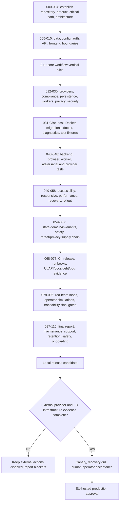

# Task Graph

## Delivery dependencies

1. The ledger contract precedes the UI and external provider adapters.
2. Authentication, role checks, source-currentness, idempotency, and audit integrity
   precede every side-effecting workflow.
3. A package/approval precedes delivery; provider receipt precedes delivered state;
   client evidence precedes accepted state.
4. Local backup verification precedes hosted migration. Empty managed PostgreSQL,
   private object storage, DPA/residency/retention declarations, and storage probes
   precede hosted startup.
5. Lint, audit, release contract, unit/integration, build, browser, and container
   verification precede release. Provider acceptance and recovery drills precede
   real production enablement.

## Stabilization gates

| Gate | Exit condition |
| --- | --- |
| G0 Repository | clean understood starting point; no duplicate runtime |
| G1 Runtime | one Node process and built React client work locally |
| G2 Data | migrations, transactions, audit, replay and backups verify |
| G3 Product | contractor critical path works without fake side effects |
| G4 Security | auth, role, CORS, rate, file, portal, safety controls verify |
| G5 Delivery | CI/build/browser/container gates pass |
| G6 Hosted | operator supplies EU provider evidence and completes migration/recovery/canary |
